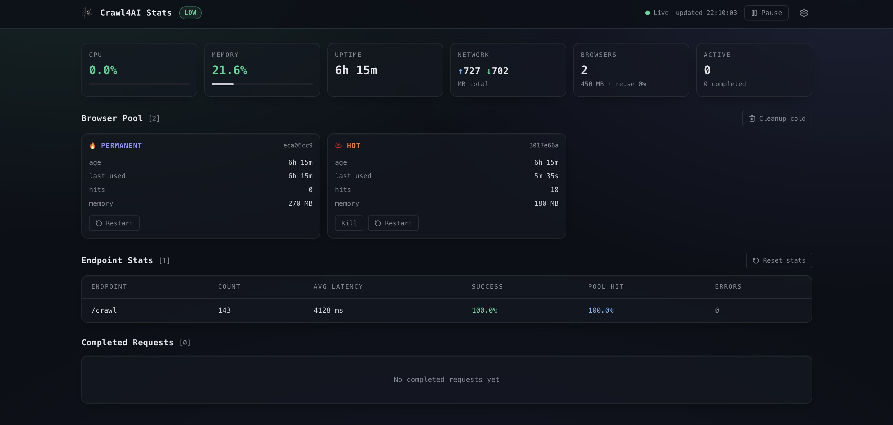

# 🕷️ Crawl4AI Stats

Real-time monitoring dashboard for self-hosted [Crawl4AI](https://github.com/unclecode/crawl4ai) servers (v0.9.x).

 



## What it does

Crawl4AI Stats polls your server's `/monitor/*` API endpoints and displays:

- **System health** — CPU, memory, uptime, network usage, memory pressure
- **Browser pool** — permanent, hot, and cold browsers with age, hits, memory, and kill/restart controls
- **Endpoint statistics** — request count, average latency, success rate, pool hit rate per endpoint
- **Active requests** — live view with elapsed time counter
- **Completed requests** — status, URL, elapsed time, memory delta, pool hit indicator
- **Error log** — recent errors with timestamp, endpoint, and error message
- **Actions** — force cleanup cold browsers, kill/restart individual browsers, reset endpoint statistics

All connection details (server URL and API token) are stored in your browser's localStorage. Nothing is sent to any third party.

## Requirements

- A self-hosted Crawl4AI server running **v0.9.x** with the monitor API enabled (enabled by default)
- Node.js 18+ (used for the built-in proxy server)

No CORS configuration is needed on your Crawl4AI server. The dashboard includes a lightweight Node.js proxy that makes all API requests server-side, avoiding browser CORS restrictions entirely.

## Quick start

```bash
git clone https://github.com/promptagency/crawl4ai-stats.git
cd crawl4ai-stats
npm install
npm run dev
```

Open `http://localhost:5173`, click the settings icon, enter your Crawl4AI server URL and API token, and hit **Test connection**.

## Deploying

Build and start the production server:

```bash
npm run build
npm start
```

The server runs on port 3001 by default (override with `PORT` env var). It serves the static dashboard and proxies API requests to your Crawl4AI server. Put it behind Nginx, Caddy, or any reverse proxy for HTTPS.

### Docker

```dockerfile
FROM node:22-alpine AS build
WORKDIR /app
COPY package*.json ./
RUN npm ci
COPY . .
RUN npm run build

FROM node:22-alpine
WORKDIR /app
COPY --from=build /app/dist ./dist
COPY --from=build /app/server.js .
COPY --from=build /app/package.json .
EXPOSE 3001
CMD ["node", "server.js", "--production"]
```